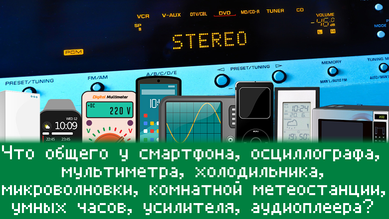
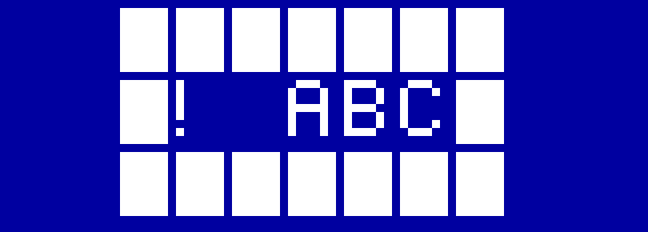
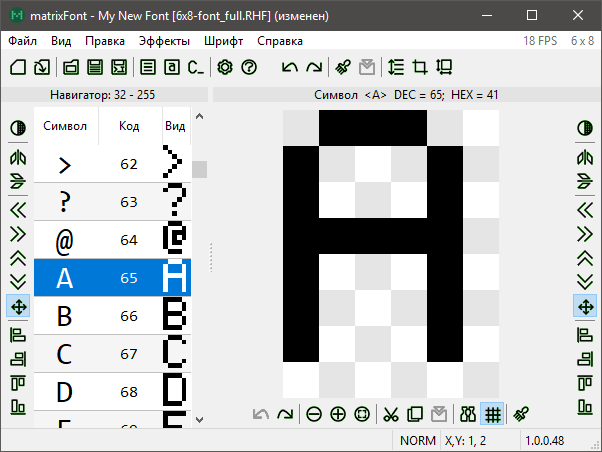
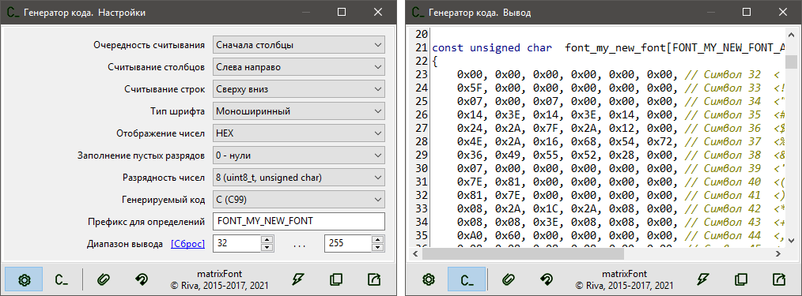
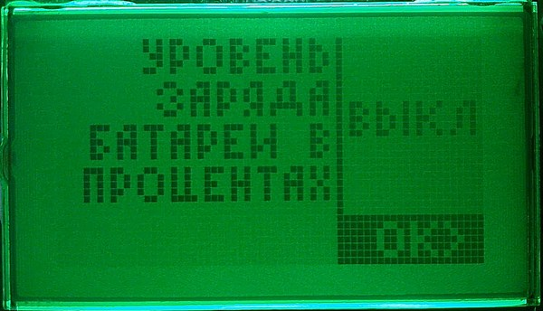

# Шрифты для графического дисплея? Это же очень просто


## Немного лирики



Скажете, это же все электрические приборы? Бесспорно. Но еще у них есть дисплей. Да, холодильники  чаще могут обходиться без дисплея, чем смартфоны, но это неточно. В этом вопросе время на стороне холодильников. :)

В огромном числе современных электронных устройств, как в узкоспециализированных приборах, так и в массовых гаджетах, применяются средства отображения информации, среди которых растровые графические дисплеи занимают доминирующее место. Дисплеи повышают на порядок (часто на несколько) информативность и способствуют созданию более лаконичного, не перегруженного механическими органами управления, корпуса устройства. Также графические дисплеи дают разработчику свободу в создании пользовательского интерфейса: от простого с несколькими строками текста до навороченного с таким количеством текстовой и графической информации, на какое только способна фантазия разработчика.


Однако, графический интерфейс пользователя практически никогда не может быть реализован только графическими примитивами — точками, линиями, геометрическими фигурами — без использования текста. Текст точно и однозначно "рассказывает" человеку о параметрах системы, ее настройках, прошлом и текущем состояниях.

Сегодня широкое распространение получила пользовательская и специальная электронная техника, значительная часть которой построена на базе микроконтроллеров. Микроконтроллер представляет собой вычислительную платформу, которая может быть запрограммирована почти неограниченным количеством алгоритмов, реализованных на разных языках программирования. Правда, на реализацию накладывают свои ограничения небольшой размер памяти программ (в среднем от единиц килобайт до единиц мегабайт) и ещё меньший размер оперативной памяти, обычно на порядок. А вот драйверы дисплеев, графические библиотеки и сам пользовательский графический интерфейс — отнюдь не компактные алгоритмы. Именно поэтому Вы вряд ли отыщете графические библиотеки для систем на микроконтроллерах, которые бы использовали "взрослые" векторные шрифты для вывода текста. Конечно, есть и такие микроконтроллеры, которые могут дать жару многим серьезным микропроцессорам прошлых лет, но это уже отдельная "весовая категория".


## Embedded-шрифт изнутри

Обычно для решения задачи вывода текста в памяти программ создаётся специальный массив данных, так называемая таблица знакогенератора. Не пугайтесь, что он специальный, — все очень просто. В массиве-таблице по сути хранятся растровые изображения всех необходимых приложению символов. Функция графической библиотеки, выводящая текстовые строки, по очереди считывает из таблицы изображение каждого символа и "рисует" его в нужной позиции на дисплее. Все! Идея проста, как столб.

Рассмотрим пример такой таблицы. Предположим, что нам требуется изображение символа шириной 6 и высотой 8 пикселей. Причем, вертикальный ряд пикселей — столбец высотой 8 пикселей — будем кодировать ровно одним байтом. Самый первый байт будет кодировать самый левый столбец. Самый младший бит будет кодировать самый верхний пиксель столбца. Вот пример части такой таблицы:

```c
0x5F, 0x00, 0x00, 0x00, 0x00, 0x00, // Символ 33  <!>
...
0x7E, 0x09, 0x09, 0x09, 0x7E, 0x00, // Символ 65  <A> 
0x7F, 0x49, 0x49, 0x49, 0x36, 0x00, // Символ 66  <B> 
0x3E, 0x41, 0x41, 0x41, 0x22, 0x00, // Символ 67  <C> 
```

А вот та же часть в двоичной записи (посмотрите внимательно на биты — каждый из них кодирует один пиксель изображения):

```c
0b01011111, 0b00000000, 0b00000000, 0b00000000, 0b00000000, 0b00000000, // Символ 33  <!> 
...
0b01111110, 0b00001001, 0b00001001, 0b00001001, 0b01111110, 0b00000000, // Символ 65  <A> 
0b01111111, 0b01001001, 0b01001001, 0b01001001, 0b00110110, 0b00000000, // Символ 66  <B> 
0b00111110, 0b01000001, 0b01000001, 0b01000001, 0b00100010, 0b00000000, // Символ 67  <C> 
```

И, конечно же, посмотрим, как эти символы выводятся на дисплее (прямоугольники для лучшего представления знакомест символов):



Такой подход в хранении шрифта имеет свои преимущества и недостатки.

К преимуществам можно отнести небольшой размер таблицы знакогенератора в сравнении с размером файлов стандартных форматов шрифтов для "больших" систем, а также простоту программной реализации графических библиотек, основанных на этом подходе. И первое, и второе чрезвычайно важны в условиях жесткого дефицита памяти и вычислительных возможностей микроконтроллеров.

К недостаткам следует отнести проблемы с масштабированием, что является прямым следствием растровой природы такого шрифта. Приемлемый по качеству результат получается только, если увеличивать размер символов в кратное количество раз, например, в два, три или четыре раза. В таком случае нет искажений изображений символов, но чем больше кратность увеличения, тем более заметна "растровость" символов. Если в разрабатываемой системе требуется иметь несколько разных шрифтов и масштабирование одного не решает задачу удовлетворительно, тогда используют несколько шрифтов — таблиц знакогенератора.


## Предыстория

В своё время мне пришлось разрабатывать программное обеспечение для устройства с графическим дисплеем RDX0120 на контроллере UC1601s. Использовался микроконтроллер Microchip PIC18. Тогда была найдена только одна работающая реализация драйвера, которая была жутко медленной и использовала моноширинный шрифт, внешним видом которого можно разве что отпугнуть будущего пользователя.

И вот, не впечатлившись результатом, была изучена документация на контроллер дисплея и разработана довольно быстрая библиотека. Шрифт, естественно, было решено сделать заново. Хотелось также, чтобы шрифт был не только моноширинным, но и пропорциональным, то есть чтобы символы в ширину занимали ровно столько места, сколько им требуется, с равным межсимвольным расстоянием.

Тут-то и понадобилось приложение, умеющее создать ту самую таблицу знакогенератора. Разработчики, которые хоть раз сталкивались с подобной проблемой, сразу же скажут: "Задача известная, решение тоже — утилита от MikroElektronika для создания именно таких шрифтов, и код генерирует аж на трех языках". Действительно, есть такая утилита. Я тоже пробовал ее использовать. Впечатления двоякие. Вроде бы все работает, и в то же время не хватает удобства и гибкости, сама таблица знакогенератора генерируется только по одному единственному алгоритму, который, очевидно, используется в графических библиотеках от той же MikroElektronika.


## Идея

Народная мудрость гласит: "Если хочешь сделать что-то хорошо, сделай это сам". После изучения утилиты от MikroElektronika вдоль и впоперек пришло понимание, что так жить дальше нельзя. :) Тогда было решено начать собственный проект приложения, которое смогло бы удовлетворить самого привередливого разработчика. Хотелось видеть удобный редактор символов, предварительный просмотр образцов текста, наглядный импорт системных шрифтов, компактный формат хранения шрифтов, настраиваемый генератор кода и, конечно же, гибкость внешнего вида и функций приложения.

Как, наверное, большинство начинающих разработчиков, я был величайшим оптимистом и оценил время разработки в несколько месяцев. Как же я ошибался! Нет, действительно, за несколько месяцев был сделан рабочий прототип, но в таком виде его даже друзьям показывать было стыдно. Начался долгий процесс доведения до ума, в ходе которого приложение много раз изменилось внешне, обросло многими полезными и удобными инструментами. К сожалению, проект всегда был хоббийным, поэтому разработка была сильно неравномерной и разорванной во времени. Что в итоге сказалось на сроках выпуска готового приложения. Ведь старт проекту был дан где-то в конце 2015, а сейчас уже 2021.


## Показывай уже!

"Вот он! Вот он — этот коварный тип..." ([с](https://www.youtube.com/watch?v=jFknbXtzHpM)).



Это приложение, которое умеет создавать растровые шрифты с нуля или на основе установленных системных. Имеет широкие возможности редактирования как отдельных символов, так и всего шрифта. И, конечно же, генерирует код на Си — ту самую таблицу знакогенератора. Причём этот генератор также имеет множество настроек, что позволяет интегрировать созданный шрифт в разные программные решения.



Полагаю, что дальше расписывать работу приложения будет нецелесообразно — получится длинное руководство пользователя. Которое, кстати, [присутствует](https://gitlab.com/riva-lab/matrixFont/-/blob/master/help/matrixFont-help.md) в репозитории проекта.

Пример реализации очень мелкого шрифта — меньше просто физически некуда.




## Послесловие

Проект приложения имеет открытые [исходные коды](https://gitlab.com/riva-lab/matrixFont) и является свободным программным обеспечением.

Сейчас приложение [выпущено](https://gitlab.com/riva-lab/matrixFont/-/releases) только под Windows. Может быть, в неопределённом будущем, будут выпуски и под другие ОС.

На сегодня в приложении доступно две локализации интерфейса — русская и английская. Если в сообществе появятся желающие помочь перевести приложение и справочные материалы на свой родной язык, добро пожаловать в [репозиторий](https://gitlab.com/riva-lab/matrixFont) проекта. Там Вы найдёте всю необходимую информацию для перевода.

И, естественно, автор ждёт Ваших отзывов и комментариев — от похвалы до жёсткой критики. Всем удобной работы и хорошего настроения! ;)

