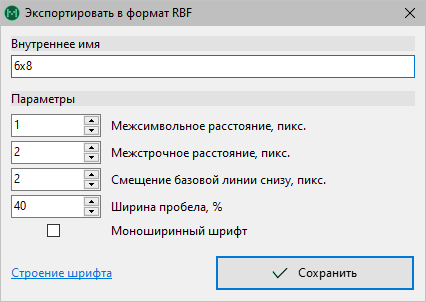
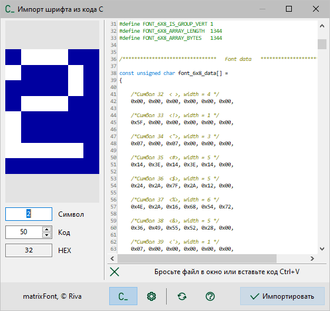
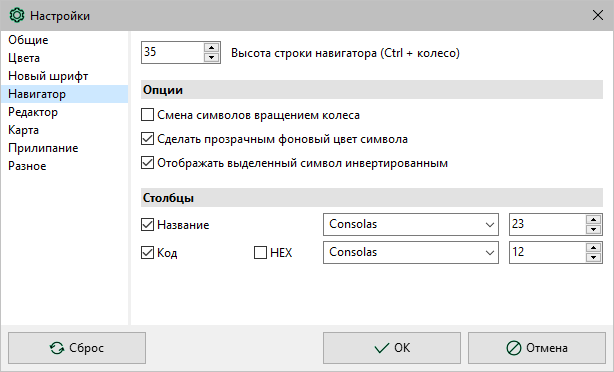
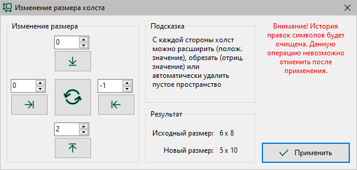
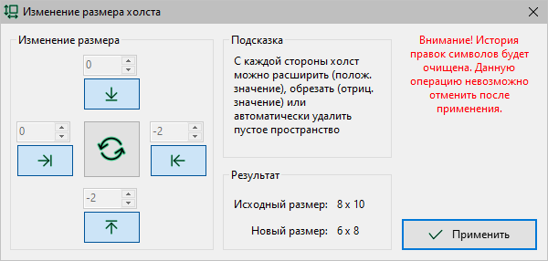
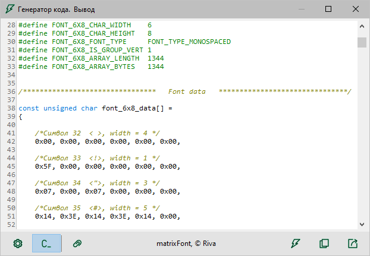

matrixFont v2.1. Руководство пользователя
=========================================

[TOC]

# Введение

**matrixFont** позволяет создавать, редактировать растровые шрифты и генерировать код *C* для подключения созданного шрифта к проекту программного обеспечения.

Основная область применения — разработка проектов программного обеспечения с использованием графического интерфейса пользователя во встраиваемых системах. 

---

Возможности **matrixFont**:

- растровый шрифт:
  
  - размеры символа от 1 × 1 до 100 × 100 (технически до 512 × 512);
  - диапазон символов от 0 до 255;
  - выбор кодовой страницы (кодировки);
  - компактный собственный формат файла **RHF**;
  - поддержка загрузки/сохранения шрифта в формате RBF;

- создание проекта:
  
  - на основе системного шрифта;
  - из кода (поддержка форматов *matrixFont*, *AdaFruit GFX*, *LCD Vision V1.34*);
  - из изображения карты символов с метаинформацией;

- редактор символов:
  
  - удобное редактирование мышью;
  - масштабирование рабочего поля колесом мыши;
  - копирование, вставка и перемещение символов;
  - импортирование изображения в символ;
  - история операций редактирования для каждого символа;
  - операции: инверсия, отображение, поворот, сдвиг, прижатие, центрирование символов;
  - пакетное редактирование всех символов шрифта;

- навигация и предпросмотр:
  
  - навигатор по символам с отображением символов;
  - поиск символов по коду или по названию;
  - просмотр образца текста;
  - карта символов;
  - экспортирование карты символов в изображение;

- инструменты:
  
  - изменение диапазона символов шрифта;  
  - изменение размера символов шрифта;
  - оптимизация размера символов;
  - генератор кода *C* с тонкой настройкой;

- интерфейс:
  
  - интуитивный и дружественный дизайн,
  - полная поддержка дисплеев разной плотности,
  - поддержка локализаций,
  - поддержка тем: светлая и темная,
  - гибкость — настройка внешнего вида, цветов и пр.,

- а также:
  
  - подробная справка.

# Проект шрифта

**matrixFont** работает с проектами в собственном оригинальном формате. Кроме этого, есть несколько вариантов создать проект шрифта из уже существующего шрифта в другом формате, используя инструменты [импорта](#импорт).

## Создание

Команда `Файл > Новый шрифт…` открывает диалоговое окно создания нового шрифта.

Задайте название, автора, кодировку, код первого и последнего символа, ширину и высоту символа в пикселях. После нажатия кнопки `Создать` будет создан новый шрифт с заданными установками.

При запуске **matrixFont** автоматически создается новый шрифт с параметрами по умолчанию, которые можно изменить в настройках, вкладка *Новый шрифт*. Если установлен флажок `Загружать последний открытый файл при запуске` (настройки, вкладка *Разное*), вместо создания нового шрифта будет загружен последний ранее открытый файл.

## Сохранение

Созданный и отредактированный шрифт можно сохранить в файл. **matrixFont** использует собственный компактный формат **RHF (Raster Hardware Font)**. Чтобы сохранить шрифт, используйте эти команды:

| Кнопка                     | Команда меню `Файл` | Что делает                                                                                                  |
|:--------------------------:|:-------------------:| ----------------------------------------------------------------------------------------------------------- |
|     | `Сохранить`         | Если шрифт был загружен из файла, то команда перезапишет исходный файл, иначе предложит диалог выбора файла |
|  | `Сохранить как…`    | Всегда отображает диалог выбора файла, в который сохранять шрифт                                            |

### Сохранение в формат RBF

В версии **2.1** появилась поддержка сохранения шрифта в формате RBF. При этом шрифт RBF экспортируется из внутреннего представления шрифта **matrixFont**. Некоторые второстепенные свойства, заданные в **matrixFont**, будут утрачены.

Если выбрать в диалоге сохранения формат RBF, после подтверждения появляется окно с настройками экспорта в RBF.

Чтобы получить хорошо выглядящий пропорциональный шрифт, перед сохранением прижмите все символы к левому краю. Для создания моноширинного шрифта отцентрируйте все символы по горизонтали.

> **RBF (Raw Bitmap Font)** — это простой [формат](http://fileformats.archiveteam.org/wiki/Raw_Bitmap_Font) шрифта, который хранит данные шрифта в виде сырого растрового изображения. Это базовый и легковесный формат шрифта, который использовался в ранних компьютерных системах и встроенных устройствах, где память и место на носителе были ограничены. Шрифты RBF все еще могут использоваться в некоторых специализированных приложениях или устаревших системах.
> 
> Этот формат используется в альтернативной прошивке [CHDK](https://chdk.fandom.com/wiki/CHDK) (Canon Hack Development Kit). При этом CHDK игнорирует параметры **Межстрочное расстояние** и **Смещение базовой линии**.

## Загрузка

Для загрузки ранее сохраненного шрифта в формате **RHF**, используйте команду `Файл > Открыть…`. Также можно загрузить шрифт в **matrixFont** просто перетащив файл в окно.

В версии **2.1** появилась поддержка загрузки шрифта в формате RBF, который импортируется во внутреннее представление шрифта **matrixFont**.

## Импорт

**matrixFont** имеет несколько вариантов создать проект шрифта из уже существующего шрифта в другом формате:

- [из системного шрифта](#из-системного-шрифта),
- [из кода *С*](#из-кода-c),
- [из карты символов](#из-карты-символов) с метаинформацией.

### Из системного шрифта

**matrixFont** может создать проект, используя установленный в системе шрифт (TTF, OTF, FON и др.).

Команда `Файл > Импорт шрифта…` открывает диалоговое окно **Импорт шрифта**.

Выберите шрифт, задайте его размер и начертание. Размеры холста символа устанавливаются автоматически, но их можно изменить.

Контролируйте вид символов по образцу текста, который выводится в верхней части окна. Образец можно масштабировать колесом мыши.

Задайте также следующие опции:

- кодировка — определяет набор символов шрифта,
- прижатие символов к левому краю холста,
- оптимизация пустого пространства вокруг символа.

### Из кода *C*

**matrixFont** может создать проект из кода *C*: команда `Файл > Импорт кода C…` открывает соответствующее диалоговое окно. В нем есть две вкладки: **Код C** и **Параметры декодера**.

#### Вкладка *Код C*

На вкладке **Код C** можно задать код, из которого будет декодирован шрифт. Перетащите файл с кодом в окно импорта или просто вставьте код из буфера обмена комбинацией `Ctrl + V`.

#### Вкладка *Параметры декодера*

На вкладке **Параметры декодера** можно настроить параметры для корректного считывания символов шрифта из кода.

Слева в окне отображается символ предпросмотра, который задается полями под ним.

Вверху отображается образец текста (до 8 символов), который задается и отключается элементами под ним.

Значение параметра **Тип шрифта** задает основной алгоритм декодирования:

- **matrixFont** — собственный формат кода; может потребоваться дополнительно указать очередность считывания и порядок бит, остальные параметры будут считаны из макроопределений.
- **AdaFruit GFX** — формат кода шрифтов от *AdaFruit*.
- **LCD Vision V1.34** — формат кода утилиты *LCD Vision V1.34*, может потребоваться дополнительно указать очередность считывания.
- **Настройка вручную** — декодер настраивается подбором всех доступных параметров вручную.

#### Подбор параметров вручную

Если параметр **Тип шрифта** установлен в *Настройка вручную*, то требуется задать все параметры. Придерживайтесь следующего алгоритма:

1. Просмотрите код, часто из идентификаторов, структуры или комментариев можно извлечь некоторые из параметров. Пропустите пункты ниже для параметров, которые точно известны.
2. Установите максимальный **диапазон символов** 0 … 255.
3. Установите параметры **смещение массива/символа** в 0.
4. Установите символ предпросмотра (слева) первый из диапазона, т. е. с кодом начала диапазона. При этом **образец текста** (вверху) можно временно отключить для повышения производительности.
5. Установите **размер холста** в несколько раз больше предполагаемого размера символа.
6. Установите **очередность считывания** *Сначала столбцы* и **ширину** побольше. Изменяя **высоту**, попытайтесь получить осмысленное изображение, похожее на строку из символов, в предпросмотре.
7. Если получите строку, но символы в ней повернуты на 90°, тогда измените параметр **очередность считывания**. Теперь установите **высоту** побольше в несколько раз, и изменяя **ширину**, снова попытайтесь получить осмысленное изображение.
8. При подборе параметров п. 6 и п. 7 время от времени изменяйте параметр **порядок бит**, что может помочь получить осмысленное изображение.
9. Уменьшайте **высоту** (или **ширину**, для параметра **очередность считывания** *Сначала столбцы*) до размера символа. Можно также подобрать размер, при котором в предпросмотре будет видно целое количество символов: разделив подобранное значение на это количество, получим искомый размер.
10. Если **образец текста** (вверху окна) выводится символами с разным смещением по вертикали, изменяйте параметр **смещение символа**, пока символы не будут выводиться ровной линией.
11. Если не удается полностью избавиться от артефактов на образце текста, изменяйте параметр **смещение массива**.
12. Постепенно увеличивайте начало диапазона, пока не получите правильный **образец текста**.

Это примерный способ подбора параметров. В конкретном случае можно попробовать и другие, более подходящие, способы.

### Из карты символов

Это уникальная опция, позволяющая считать проект шрифта из PNG-изображения карты символов, ранее сгенерированного **matrixFont**.

Откройте изображение командой `Символ > Импорт изобажения…` или просто перетащите и бросьте его в редактор. Подтвердите импорт из карты символов в появившемся диалоге.

> **Обратите внимание**.
> 
> Импортирование шрифта возможно только из изображения карты, которое не изменялось с момента его создания (экспорта). Подробнее об этом — см. [Карта символов](#карта-символов), [Метаинформация карты](#метаинформация-карты).
> 
> Если в изображении не будет обнаружено метаинформации, тогда произойдет обычный [импорт изображения](#импорт-изображения) на холст.

## Свойства шрифта

Команда `Инструменты > Свойства шрифта…` отображает окно просмотра служебной и дополнительной информации о шрифте и файле.

В окне **Свойства шрифта** отображаются следующие данные:

- название, также используется при генерировании кода *C*,
- автор,
- кодовая страница, или же кодировка,
- размеры холста символов — ширина и высота,
- диапазон символов — коды первого и последнего символов,
- расположение файла, если проект был сохранен или загружен из файла,
- дата и приложение создания проекта,
- дата и приложение сохранения последней правки.

Название, автора и кодировку шрифта можно изменить, после чего нажать кнопку `Применить`, чтобы изменения были внесены. Остальные данные носят информационный характер и не подлежат редактированию в этом окне. Для изменения диапазона или размеров холста есть специальные [инструменты](#инструменты-правки-шрифта), описанные далее.

# Главное окно

1. Панель **Файл**.

2. Главное меню.

3. Панель **Инструменты**.

4. Информация о проекте: кодировка и размер холста.

5. [Навигатор](#навигатор).

6. [Редактор](#редактор) символа.

7. Панель [**Инструменты шрифта**](#пакетное-редактирование).

8. Статусная строка.

9. Панель [поиска](#поиск).

10. Панель [**Инструменты символа**](#операции-редактирования-символа).

## Навигатор

Навигатор — левая часть главного окна **matrixFont**. Это список символов шрифта, который позволяет быстро перемещаться между символами. Также отображает код символа (десятичный или шестнадцатеричный) и его начертание текущим редактируемым шрифтом.

Навигатор можно скрыть: команда-флажок `Вид > Навигатор` или флажок во всплывающем меню панелей инструментов.

Высоту строки можно изменить колесом мыши с зажатой клавишей `Ctrl` или в настройках. В настройках на вкладке *Навигатор* доступно еще несколько дополнительных опций.

## Редактор

Редактор символов — правая часть главного окна **matrixFont**.

Изображение в редакторе можно масштабировать колесом мыши или командами из раздела меню `Вид > Масштаб:`. Команда `Вид > Вписать` задает оптимальный масштаб так, чтобы холст целиком помещался в редакторе.

Флажок `Вид > Сетка` управляет видимостью пиксельной сетки холста. В настройках на вкладке *Редактор* можно включить шахматный фон в дополнение к сетке или вместо нее.

# Редактирование

**matrixFont** поддерживает несколько приемов редактирования шрифта:

- [пиксельное](#пиксельное-редактирование) редактирование символа;
- [операции](#операции-редактирования-символа) с символом;
- [пакетное](#пакетное-редактирование) редактирование всех символов;
- специальные [инструменты](#инструменты-правки-шрифта) правки шрифта.

## Пиксельное редактирование

Пиксельное редактирование осуществляется мышью в редакторе символа.

Щелчок левой кнопкой устанавливает пиксель, правой — очищает, средней — инвертирует.

Чтобы изменить всю строку, удерживайте `Ctrl` при щелчке кнопкой мыши.

Чтобы изменить весь столбец, удерживайте `Shift` при щелчке кнопкой мыши.

## Операции редактирования символа

Операции редактирования символа расположены в меню `Символ` и на панели `Инструменты символа` справа от редактора.

| Кнопка                               | Меню `Символ`         | Действие                                                                                                                  |
|:------------------------------------:|:---------------------:| ------------------------------------------------------------------------------------------------------------------------- |
|              | `Очистить`            | Очищает символ                                                                                                            |
|             | `Инвертировать`       | Инвертирует все пиксели символа                                                                                           |
|  | `Отобразить > …`      | Зеркально отображает символ в выбранном направлении                                                                       |
|  | `Сдвиг > …`           | Перемещает символ на одну строку или столбец                                                                              |
|        | `Сдвиг > С переносом` | Если этот флажок установлен, то при сдвиге крайний вытесняющийся столбец или строка вставляется с противоположной стороны |
|   | `Прижать > …`         | Перемещает символ к выбранному краю так, чтобы не осталось чистого столбца или строки с этого края                        |
|  | `Центрировать > …`    | Перемещает символ так, чтобы он оказался посередине в выбранном направлении                                               |
|           | `Переместить вверх`   | Обменивает местами текущий символ и предыдущий                                                                            |
|         | `Переместить вниз`    | Обменивает местами текущий символ и следующий за ним                                                                      |

## Пакетное редактирование

Операции пакетного редактирования применяются ко всем символам шрифта. По действию они аналогичны операциям с символом, находятся в меню `Шрифт` и на панели `Инструменты шрифта` слева от навигатора.

## Инструменты правки шрифта

**matrixFont** поддерживает несколько специальных инструментов правки всего шрифта:

- [задание диапазона символов](#задание-диапазона-символов),
- [изменение размера холста](#изменение-размера-холста),
- [оптимизация размера холста](#оптимизация-размера-холста).

> **Обратите внимание!**
> 
> После применения этих инструментов история правок всех символов будет *очищена*. Эти операции невозможно отменить после применения.

### Задание диапазона символов

Команда `Инструменты > Задать диапазон…` позволяет добавить в шрифт новые символы или убрать ненужные (только с краев диапазона).

В диалоговом окне задайте коды начального и последнего символов шрифта. Если некоторые символы из предыдущего диапазона не войдут в новый диапазон, то они будут утеряны. Если новый диапазон содержит символы, которые не входили в предыдущий диапазон, то они будут созданы пустыми.

### Изменение размера холста

Команда `Инструменты > Изменить размер холста…` позволяет изменить размер холста символов существующего шрифта.

В диалоговом окне выберите действие — расширить или обрезать, введите в соответствующие поля нужные значения.

### Оптимизация размера холста

Команда `Инструменты > Оптимизация размера холста…` удаляет общие для всех символов пустые строки и/или столбцы с краев холста.

В диалогом окне задайте границы оптимизации — с каких краев нужно удалять пустые строки и/или столбцы.

## История правок

Каждый символ имеет свою историю правок, которая хранит все этапы редактирования. История правок доступна только в текущем сеансе работы. История очищается у всех символов при [создании](#создание) нового шрифта, [загрузке](#загрузка) шрифта из файла или применении некоторых [инструментов](#инструменты-правки-шрифта).

Для перемещения по истории правок символа используйте команды `Отменить` и `Повторить` из меню `Символ`.

Для отмены или повтора пакетной операции предназначены команды `Отменить` и `Повторить` из меню `Шрифт`, которые применяют соответствующие символьные команды ко всем символам шрифта одновременно.

## Копирование и вставка

Меню `Символ` содержит команды для работы с буфером обмена: `Вырезать`, `Копировать`, `Вставить`. При копировании и вырезании в буфер обмена помещается весь символ целиком. При вставке символа из буфера обмена его верхний левый край совмещается с верхним левым краем текущего холста.

Поддерживается копирование/вставка символов между холстами разных размеров. Если вставляемый символ:

- больше текущего холста — вставляется только часть, которая помещается на текущем холсте;
- меньше текущего холста — вставляется целиком, а оставшаяся часть текущего холста не будет изменена.

Также есть команда пакетной вставки `Шрифт > Пакетная вставка`, которая вставляет содержимое буфера обмена во все символы одновременно.

Меню `Символ > Режим вставки` позволяет выбрать один из 4 режимов вставки. Эти же режимы можно выбрать в контекстном меню статусной строки:

| Режим вставки   | Описание                                                             |
| --------------- | -------------------------------------------------------------------- |
| Замена (NORM)   | вставляемый символ заменяет текущий                                  |
| И (AND)         | операция `И` между пикселями вставляемого символа и текущего         |
| ИЛИ (OR)        | операция `ИЛИ` между пикселями вставляемого символа и текущего       |
| Искл. ИЛИ (XOR) | операция `Искл. ИЛИ` между пикселями вставляемого символа и текущего |

## Импорт изображения

Команда `Символ > Импорт изображения…` дает возможность создать символ из произвольного изображения в одном из широко используемых графических форматов. Также можно просто перетащить графический файл в редактор.

При импорте в текущий символ будет вставлено бинаризованное изображение. Порог черного можно задать в настройках **matrixFont**, вкладка *Редактор*.

Изображение импортируется пиксель в пиксель. Если размер изображения больше размера символа, будет вставлена только часть изображения, начиная с левого верхнего угла.

## Поиск

Команда-флажок `Вид > Найти символ` позволяет быстро найти нужный символ в навигаторе и перейти к его редактированию. Если флажок установлен, в нижней части редактора отображается панель поиска, где можно задать поиск по символу или по его десятичному коду.

# Образец текста

Команда `Инструменты > Образец текста…` показывает окно с образцом текста для визуальной оценки создаваемого шрифта. Образец можно масштабировать колесом мыши, текущий масштаб отображается в заголовке окна.

Переключатель **Пропорциональный/Моноширинный** позволяет задать стиль формирования строк из символов:

- ***пропорциональный*** — все межсимвольные интервалы одинаковы и задаются значением поля **дистанция между символами**;
- ***моноширинный*** — все символы располагаются в ячейках виртуальной сетки шириной равной ширине символа, интервал между ячейками задается значением поля **дистанция между символами**.

Поле **дистанция между строками** позволяет задать дистанцию между верхом текущей строки и низом предыдущей.

| Кнопка                                  | Что делает                                                                                                                                                                                                                                  |
|:---------------------------------------:| ------------------------------------------------------------------------------------------------------------------------------------------------------------------------------------------------------------------------------------------- |
|    | Обновляет изображение образца. Изображение предпросмотра может обновляться автоматически при изменении символов в редакторе. Это можно задать в настройках, вкладка *Разное*, флажок `Обновлять образец текста предпросмотра автоматически` |
|                | Кнопка-флажок, если нажата — отображается поле, в котором можно изменить текст образца. Текст может быть произвольным                                                                                                                       |
|  | Восстанавливает текст образца по умолчанию                                                                                                                                                                                                  |
|           | Открывает диалог сохранения текущего изображения образца в формате **PNG**                                                                                                                                                                  |

# Карта символов

Команда `Инструменты > Карта символов…` показывает окно с таблицей всех символов шрифта.

Доступно несколько настроек отображения карты:

- в выпадающем списке **Столбцы** можно выбрать количество столбцов таблицы, кратное 2;
- дистанция между символами по **горизонтали**;
- дистанция между символами по **вертикали**.

Таблица символов растягивается по горизонтали так, чтобы заполнить всю ширину окна, при этом высота символов изменяется пропорционально. Щелчок по символу открывает его в редакторе.

Кнопка `Экспорт в изображение` открывает диалог сохранения изображения. Изображение карты символов имеет ту же схему расположения символов, что и в окне. В настройках, вкладка *Карта*, можно задать опции экспорта:

- пустое пространство вокруг символа, в пикселях, применяется до масштабирования;
- коэффициент масштабирования — кратность увеличения символов, чем больше значение, тем больше разрешение изображения.

## Метаинформация карты

Карта символов содержит в себе метаинформацию, которая может быть использована для обратного импорта шрифта из изображения. Однако, импортирование шрифта возможно только из изображения карты, которое не изменялось с момента его создания (экспорта). Можно только пересохранять в форматы без потерь при сжатии. Изменение размера, обрезка, изменение цветов, редактирование и т. п. операции приведут к утере метаинформации, что в свою очередь сделает невозможным импортирование проекта шрифта из этого изображения.

С использованием метаинформации появляется возможность хранить шрифт в графическом формате, что дает возможность оценивать шрифт, не открывая его в **matrixFont**. Однако имейте в виду, что при этом некоторые неосновные свойства проекта могут быть утрачены.

# Генерирование кода *C*

После завершения редактирования шрифта можно сгенерировать соответствующий код на языке *C* для использования шрифта в проектах программного обеспечения. Команда `Инструменты > Генерировать код…` открывает окно генератора кода *C*.

В окне генератора есть две вкладки: **Настройки вывода** и **Вывод**.

Во вкладке **Настройки вывода** можно гибко настроить параметры генерирования кода.

Генерирование базируется на том, что каждый пиксель символа кодируется одним битом двоичного числа. Каждая строка или столбец, в зависимости от очередности, начинают кодироваться новым числом, т. е. выравниваются по разрядности числа, т. о. это **не** битовый поток.

На вкладке **Вывод** расположено единственное поле, в котором содержится сгенерированный код.

| Кнопка                                | Что делает                                                                                                                                           |
|:-------------------------------------:| ---------------------------------------------------------------------------------------------------------------------------------------------------- |
|                | Показывает вкладку **Настройки вывода**                                                                                                              |
|              | Показывает вкладку **Вывод**                                                                                                                         |
|          | Кнопка-флажок, управляет видимостью окна генератора поверх главного окна **matrixFont**                                                              |
|  | Обновляет код. Удобно использовать, если окно генератора открыто вместе с главным окном **matrixFont**, в котором продолжается редактирование шрифта |
|                | Копирует код в буфер обмена                                                                                                                          |
|         | Открывает диалог сохранения кода в заголовочный файл *C*                                                                                             |

# Настройки

**matrixFont** имеет различные настройки внешнего вида и поведения.

| Кнопка                        | Команда меню             | Что делает                                                                                                                                                              |
|:-----------------------------:|:------------------------:| ----------------------------------------------------------------------------------------------------------------------------------------------------------------------- |
|  | `Вид > Поверх всех окон` | Команда-флажок, управляет видимостью главного окна **matrixFont** — если флажок установлен, то оно всегда будет отображаться поверх других окон, даже если теряет фокус |
|        | `Файл > Настройки`       | Открывает окно *Настройки*                                                                                                                                              |
|                               | `Вид > Панели:`          | Раздел меню с флажками, которые позволяет задать видимость панелей инструментов                                                                                         |

Большинство настроек доступны в окне *Настройки*.

## Прилипание окон

**matrixFont** имеет несколько окон, каждое из которых имеет свое назначение. Иногда, для удобства работы, может понадобиться отображать несколько окон одновременно. Тогда, чтобы окна не были беспорядочно разбросаны по рабочему столу, можно "прилепить" их к главному окну.

Также имейте в виду, что для сохранения упорядоченности, перемещать эту группу окон следует перемещением главного окна **matrixFont**. В противном случае при перемещении вспомогательного окна остальные окна будут оставаться на прежних местах.

Такое поведение можно задать в окне *Настройки*, вкладка *Прилипание*. Порядок прилипания определяет какое из окон будет прилеплено первым, какое — вторым к созданной группе окон, и т. д.

# Помощь в локализации интерфейса

Хотите видеть интерфейс **matrixFont** на своем родном языке? Вы можете внести свой вклад в перевод **matrixFont**.

**matrixFont** разработан с возможностью легкой локализации интерфейса. Файлы локализаций размещаются в каталоге [bin/lang](../bin/lang).

Пожалуйста, осуществите перевод на другой язык, следуя нижеприведенным инструкциям:

1. Откройте файл-шаблон `<project_name>.pot` (каталог bin/lang) в [Poedit](https://poedit.net).
2. Создайте новый перевод для языка, на который будете переводить.
3. Осуществите перевод с русского на свой родной язык и сохраните переведенный файл как `<project_name>.xx.po`, где `xx` — суффикс локали, обычно уже подставлен при выборе языка перевода, может быть вида `xx_yy`.
4. Вы можете использовать другой уже переведенный файл `*.??.po` в качестве опорного, если не знаете язык оригинала.
5. Предложите свой перевод на странице разработки проекта на [gitlab.com](https://gitlab.com/riva-lab/matrixFont/-/issues), открыв новое обсуждение с заголовком вида `i18n: language <your-locale> <new/fix/etc>`.
6. Если хотите использовать свой перевод, не дожидаясь его включения в релиз, добавьте в `languages.ini` определение для своего перевода:
   - увеличьте значение `Count` на единицу (`Count` показывает число доступных локализаций),
   - добавьте строку вида `L-<index>=<locale><description>`, например, `L-2=RU, Russian - Русский`,
   - обратите внимание, строка должна начинаться с суффикса локали (например, `ru` или `ru_ru`, регистр не имеет значения, пробелы и запятые после локали игнорируются).

## Список доступных языков

| Язык                               | Автор           | Переведено |
| ---------------------------------- | --------------- | ---------- |
| Русский (оригинальный, встроенный) | Riva (riva-lab) | —          |
| English                            | Riva (riva-lab) | 100%       |
