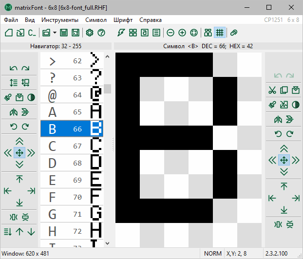

matrixFont
==========

MD/REPO: [**English**](readme.en.md) | [Русский](readme.md)

HTML: [**English**](readme.en.html) | [Русский](readme.html)

## About application

**matrixFont** allows you to create and edit raster fonts, and generate *C* code to include the created font into a software project.

The main usage area is software project development using graphical user interface in embedded systems.

### Features

- raster font:
  
  - character sizes from 1 × 1 to 100 × 100 (technically up to 512 × 512);
  - character range from 0 to 255;
  - charset (encoding) selection;
  - compact native **RHF** file format;
  - support for loading/saving fonts in RBF format;

- project creating:
  
  - from system font;
  - from code (support of *matrixFont*, *AdaFruit GFX*, *LCD Vision V1.34* formats);
  - from character map image with metadata;

- character editor:
  
  - easy editing with mouse;
  - scaling workspace with mouse wheel;
  - copy, paste and move characters;
  - importing image into character;
  - history of editing operations for each character;
  - operations: invert, display, rotate, shift, pinch, center characters;
  - batch editing of all font characters;

- navigation and preview:
  
  - character navigator with character display;
  - search for characters by code or name;
  - view sample text;
  - character map;
  - exporting character map to image;

- tools:
  
  - changing character range of font;
  - changing font character size;
  - character size optimization;
  - *C* code generator with fine-tuning;

- interface:
  
  - intuitive and user-friendly design,
  - full support for different display densities,
  - localization support,
  - theme support: light and dark,
  - flexibility - customization of appearance, colors, etc.,

- and also:
  
  - detailed user manual.

## Сompilation

Compilation details (may lose relevance over time):

1. FPC has a RegExpr module that comes with the compiler. However, it is usually rarely updated. Update it manually: copy the files with replacement from `.\libraries\TRegExpr\src\` to `<LAZARUS_DIR>\fpc\<VERSION>\source\packages\regexpr\src\`. This module is also used in system modules, so you need to update the compiled object files. To do this, do the following:
   - Open in the IDE the project `testregexpr.lpi` from the catalog `<LAZARUS_DIR>\fpc\<VERSION>\source\packages\regexpr\tests\` and compile it for all required target platforms, e.g. for `x86_64-win64` and `i386-win32`. If it doesn't compile immediately, comment out the lines pointed to by the compiler and compile again.
   - Go to the catalog `<LAZARUS_DIR>\fpc\<VERSION>\source\packages\regexpr\tests\lib\`.
   - Copy the files with replacement from the subdirectories `<TARGET>` to the appropriate catalogs `<LAZARUS_DIR>\fpc\<VERSION>\units\<TARGET>\regexpr`.

## Localization

Want to see the **matrixFont** interface in your native language? Join the translation of **matrixFont**. Start translating by choosing one of the following options:

1. Translate Gettext files directly from the repository, following the [instructions](help/matrixFont-help.md#help-in-localization-interface) in the help.

The translation will be added in the next release if it covers at least 2/3 (~67%).

## Installation

**matrixFont** can be installed as a regular application. A portable version is also available, which does not require installation and works from any directory. The installation and portable files are available under [Releases](https://gitlab.com/riva-lab/matrixFont/-/releases): this is the best way to get the latest version.

## How to use

User Manual in Russian — [help/matrixFont-help.md](help/matrixFont-help.md).

An introductory article on the topic of fonts and about app (Rus) — [Шрифты для графического дисплея? Это же очень просто](article/mf-article.md).

## Liability

**matrixFont** is provided for free use, without any warranty or technical support. You use the application at your own discretion and are solely responsible for the results of its functioning.

## Issues and suggestions

If you find a bug in the application or want to suggest something to improve the application, please go to the [Issues](https://gitlab.com/riva-lab/matrixFont/-/issues) section of the **matrixFont** project. First investigate if a similar or the same issue has been opened before. Do not create duplicate issues, update or reopen existing ones - this speeds up their review. If your issue has not been raised before, create a new issue.

Your questions and suggestions help improve **matrixFont**.

## Сopyright and credits

Copyright 2015-2024 Riva, [FreeBSD License, modified](license.md). [Changelog (Ru)](versions.md).

Developed in [Free Pascal RAD IDE Lazarus](http://www.lazarus-ide.org) v2.2.6, [Free Pascal Compiler](https://freepascal.org) v3.2.2.

The installer for Windows is created in [Inno Setup](https://jrsoftware.org/isinfo.php). [Copyright](https://jrsoftware.org/files/is/license.txt) (C) 1997-2023, Jordan Russell, Martijn Laan.

Installer icon: [icon-icons.com](https://icon-icons.com/icon/software/76005), [CC BY 4.0](https://creativecommons.org/licenses/by/4.0).

## Dependencies

- [TRegExpr](https://github.com/andgineer/TRegExpr) — regular expressions engine in pure Object Pascal. Copyright (c) 1999-2004 Andrey V. Sorokin.
- [metadarkstyle](https://github.com/zamtmn/metadarkstyle) — package that adds dark theme to your program under windows 10. Copyright (c) 2023 zamtmn.
- [BGRABitmap](https://bgrabitmap.github.io/) — a package designed to modify and create images with transparency.
- [BGRA Controls](https://bgrabitmap.github.io/bgracontrols/) — a set of graphical UI elements. Author: Lainz.
- [ImageSVGListDsgn](https://gitlab.com/riva-lab/ImageSVGListDsgn) — a list of SVG images instead of regular bitmaps. Copyright (c) 2023 Riva.
- [OnlineUpdater](https://gitlab.com/riva-lab/OnlineUpdater) — package for updating application from online repository. Copyright (c) 2023 Riva.
- [AppFeaturesPkg](https://gitlab.com/riva-lab/AppFeaturesPkg) — package for customizing GUI applications and implementing standard application functionality. Copyright (c) 2024 Riva.
